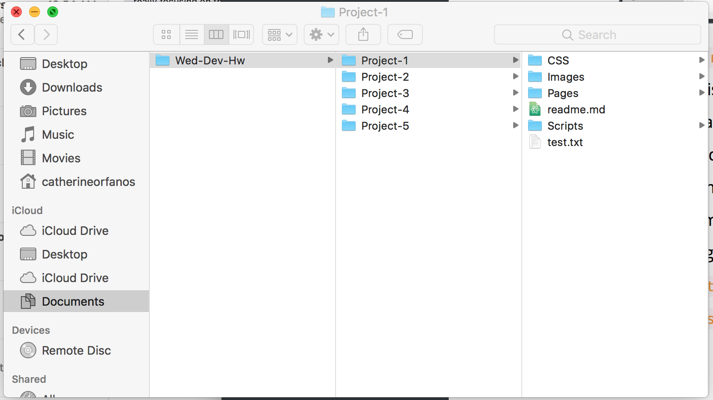

 # My First README.md
 ---
 ## **Catherine Orfanos**

 This is my first readme and my encounter with all this new technology, I am definetly **overwhlemed!** This first week of the course has been challengeing trying to figure out all these new sites and platforms.


 I am excited to learn how this all works, I am just a bit stressed out at the moment!!

 ### I am most excited about:
 - learning code! I think this class will be a great start to learning code.
 - learning about the internet!I never knew how much I didn't know about the internet and I use it everyday!
 - being more experience with this new technology!I always have liked a challege, I am excited to learn about these new systems!


This is my first time on [GitHub](https://github.com) so I am learning alot as I go!

### I really have enjoyed the content we have covered so far:
1. The videos on the internet
2. The 12 chapter on webdevelopment
3. Readings from the book

 I do think I am a well organized person so I feel good in the fact that I can keep all my projects in order. My files are arraged well, 
 *I am excited to get started with more projects!*


```# Can't wait to see what the rest of the semester holds!```
