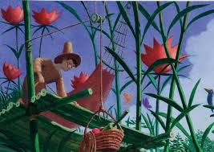

# **Starting Project 3**
Catherine Orfanos
___
**Week 1** This week we started to learn more about CSS

This project I will create a literature showcase site, either being:
- A Blog
- An Article
- Book, Essay or Poem

Outcomes:
- 3 Page Site
- Emphasis on Styling
- Clean, graphic display, highlighting written content
- Use of IDs, classes, and pseudo-classes.

This first I learned about:
- Select and declare
- Property and Value
- Style Guide
- Commenting in CSS
- Selectors and changing Selectors
- Text Color and Background Color

Laying out my ideas:
1. What type of writer’s site do you think you’ll make? **Book showcase on my faveorite book from when I was a kid!**
2. Where will you get your material? **from this [site](http://www.umich.edu/~childlit/Weslandia/WESTframeset1.htm)**
3. What will you say about the author, even if it’s yourself? **I will talk about how creative the author is and the fun story line in the book**
4. Include an image of your color palette. You should have 2-6 colors max! #006598 #82b440 #95212c #fbcf61
5. My Inspiration:

**Week 2** This week I started the creation of my new repo!
