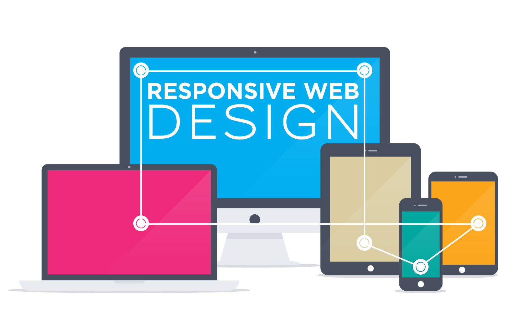

# **PROJECT 4: The Responsive Web Page**
Catherine Orfanos
___
### Last Week being a Web Dev:
"This last "project" is really just an exercise, where you'll use newly-learned techniques to create a single responsive webpage, along with a very important component of web design - wireframes."

I can't believe its already our last project! This week I learned about new web design techniques, emphasizing **WIREFRAMES**
This week I also learned about;
- media queries
- mobile first development
- responsive web design
- flex boxes

### My Site will be on: **What is Responsive Web Design?**
Content:

Definition:

Media Items I will include:

Fonts I am going to Use:
- Barlow
- Open+Sans+Condensed

Colors:
- #8dc5d1
- #f7ee42
- #e6922f
- #b8436b
- #adadad

**SITE INFO:**

**1. What is the information this page aims to deliver?** On this page I will define responsive webdesign and provide eamples.

**2. What is the first information on the page that should draw the eye?** Since this project is on Resonsive Web Design, I want the first thing views to notice is the organization and layout of the page. Information wise, the first peice of content I want the view to be drwn to is the title and simple and easy definition on RWD.

**3. What is the primary content of this page?** The primary content of this page will include a descripion and examples (Text and media) of RWD.

**4. What is the secondary content?**

### Creating the Site:
1. Sketch and Wireframe
2. Identify Possible Structure
3. Start to Build the Site with HTML and CSS
4. Test my Site on differnet interfaces

Update 1: So far so good with my first attempt at creating this page! Changes I need to make before in my next steps, include making the picture size smaller, adding a navigation bar and deveopling my text content more! Also my first test on my phone screen works pretty good! almost better than my desktop version
